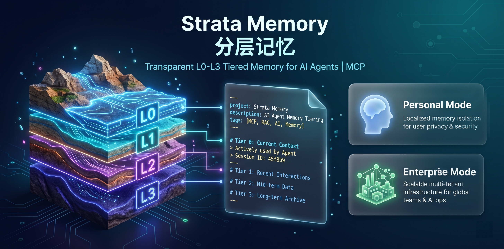

# Strata Memory 2.0（分层记忆 · 工业级 AI 记忆基座）

<p align="center">
  
</p>

[](https://pypi.org/project/strata-memory-mcp/)
[](LICENSE)
[](https://modelcontextprotocol.org)

**大模型只做决策，确定性代码接管一切。**

Strata Memory 2.0 是面向 Multi-Agent 的 **MCP 记忆中枢**：以 **SQLite 为唯一真相源（SoT）**，向量库可一键重建，Markdown 仅为只读投影。写入经过 Quality Kernel / CBT 中间件；召回采用渐进式漏斗，避免上下文爆炸。

---

## 核心设计

| 层 | 角色 | 可摧毁？ |
|----|------|----------|
| **SQLite Truth Store** | 权威数据（记忆 / 审计 / 轨迹） | 否（备份） |
| **Chroma + BGE-M3** | 语义索引伴生层 | **是** — `strata_rebuild_index` |
| **Markdown projection** | 人类可读视图 | **是** — `strata_project` 再生 |

- **L0–L3 分层** + 类型化 TTL（事实/偏好/规程/情节）
- **三维隔离**：`tenant_id` + `user_id` + `session_id`
- **Scratch → Durable**：会话暂存，确认后 `promote_session`
- **防御性 MCP 契约**：工具描述强制「作用 / 触发 / 禁忌」

## 快速开始

```bash
# 推荐：环境变量注入密钥（禁止写入对话与 config 明文）
export STRATA_API_KEY=sk-...
# 可选：自定义 Palace 路径
export STRATA_PALACE=~/.strata/palace

uvx strata-memory-mcp
# 或
git clone https://github.com/vincy/strata-memory.git
cd strata-memory && uv sync && uv run strata-memory-mcp
```

### Claude Desktop

```json
{
  "mcpServers": {
    "strata-memory": {
      "command": "uv",
      "args": ["run", "--directory", "/path/to/strata-memory", "strata-memory-mcp"],
      "env": {
        "STRATA_API_KEY": "sk-...",
        "STRATA_PALACE": "/path/to/palace"
      }
    }
  }
}
```

### Hermes

```bash
# 推荐：完整 key 写入 Hermes env（禁止 sk-xxx...yyy 脱敏占位）
echo 'STRATA_API_KEY=sk-你的完整key' >> ~/.hermes/.env

cp examples/strata-wrapper.sh ~/.hermes/scripts/strata-wrapper.sh
chmod +x ~/.hermes/scripts/strata-wrapper.sh
# config.yaml → mcp_servers.strata-memory.command = wrapper 路径
```

更多客户端示例见 [examples/](examples/) · [examples/hermes-config.yaml](examples/hermes-config.yaml)。

## MCP 工具（10 个，意图聚合）

| Tool | 意图 |
|------|------|
| `strata_init` | 初始化 SoT + 配置 |
| `commit_memory` | 经 Quality Kernel 写入事实 |
| `promote_session` | Scratch → Durable |
| `recall_context` | 渐进召回（id + 摘要 + 分数） |
| `expand_memory_detail` | 按 id 二次展开全文 |
| `strata_doctor` | SoT ↔ 索引一致性巡检 |
| `strata_rebuild_index` | 从 SQLite 全量重建向量（`confirm=true`） |
| `strata_stats` | L0–L3 Token 水位线 |
| `strata_project` | 导出只读 Markdown 投影 |
| `strata_digest` | 后台降级 / 归档（TTL + 分数） |

### 写入示例

```json
{
  "user_id": "user_001",
  "memory_type": "user_preference",
  "fact_claim": "User prefers dark mode in VS Code with Monokai Pro theme.",
  "confidence_score": 0.92,
  "session_id": "sess_2026-08-04"
}
```

### 召回示例

```json
{
  "user_id": "user_001",
  "query": "IDE theme preferences",
  "context_depth": "deep",
  "limit": 8
}
```

返回仅为卡片列表；需要细节时：

```json
{ "user_id": "user_001", "memory_id": "<id from hits>" }
```

## 禁忌（Quality Kernel 硬拦截）

- 密码 / API Key / Token
- 纯情绪发泄、无事实
- 模糊时间（刚才 / 昨天 / today）— 改用 ISO 日期
- 将「也许 / 可能 / probably」写成 `factual_truth`

## 架构一览

```
LLM ─commit_memory─► Quality Kernel ─► CBT Middleware ─► SQLite (SoT)
                                                    └─► Chroma (rebuildable)

LLM ─recall_context─► Hybrid RRF (vector + FTS5) ─► {id, summary, score}
LLM ─expand_memory_detail(id)─► detail (scope-checked)
```

完整说明：[docs/architecture.md](docs/architecture.md) · 工具契约：[docs/tools.md](docs/tools.md)

## 从 0.2.x 迁移

| 0.2.x | 2.0 |
|-------|-----|
| `memorize` | `commit_memory` |
| `wake_up` / `search` | `recall_context` + `expand_memory_detail` |
| `get_health` | `strata_stats` / `strata_doctor` |
| Markdown 直写 | SQLite SoT；Markdown 仅投影 |

**批量灌入旧 drawer（不删源文件）：**

```bash
# 预览
uv run python -m strata_memory.cli migrate --palace ~/.strata/palace

# 写入 SQLite
uv run python -m strata_memory.cli migrate --palace ~/.strata/palace --apply

# 写入 + 重建向量索引
export STRATA_API_KEY=sk-...
uv run strata-memory-migrate --palace ~/.strata/palace --apply --rebuild-vectors
```

完整说明：[docs/migration-v02.md](docs/migration-v02.md) · [CHANGELOG.md](CHANGELOG.md)

## 安全

- 默认本地存储；密钥走 `STRATA_API_KEY`，不落盘明文
- 写操作无裸 CRUD；破坏性重建必须 `confirm=true`
- 跨 `user_id` / `tenant_id` 的 expand 硬失败

见 [SECURITY.md](SECURITY.md)。

## 开发

```bash
uv sync --extra dev
uv run pytest -v
uv run strata-memory-mcp
```

## License

MIT — 见 [LICENSE](LICENSE)
